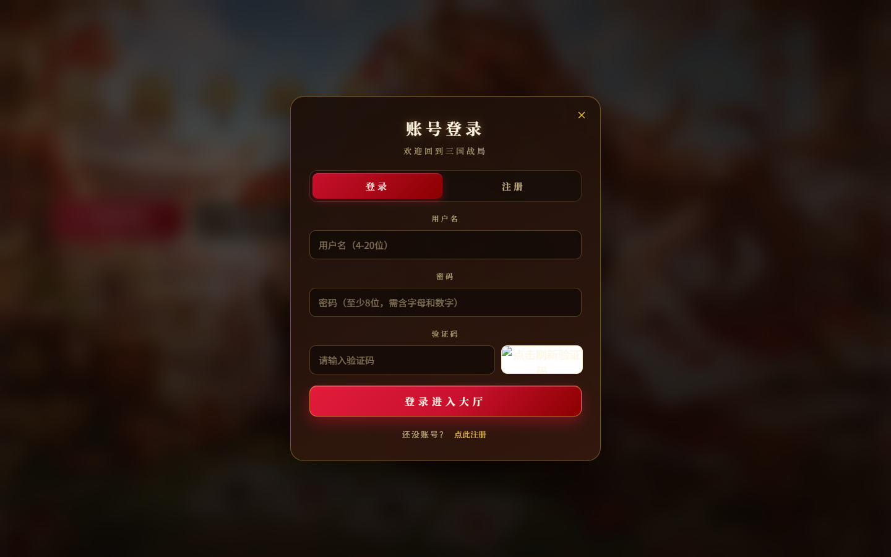
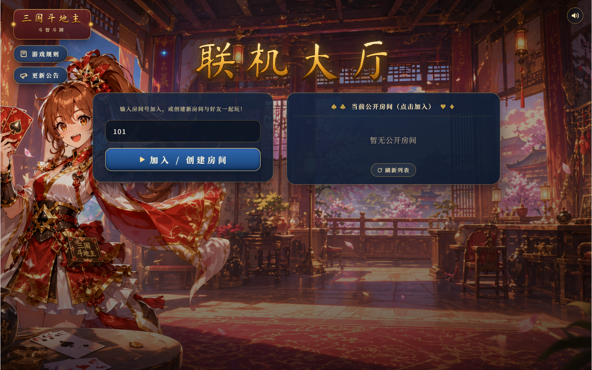
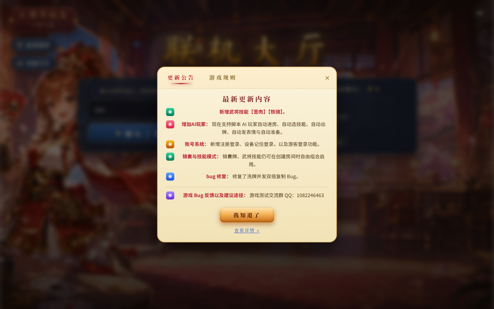
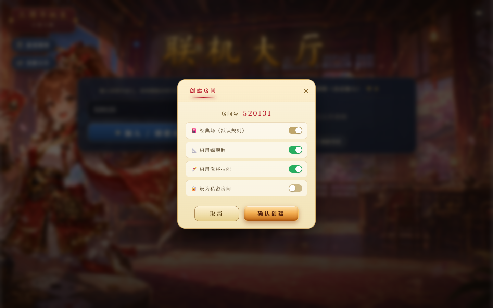
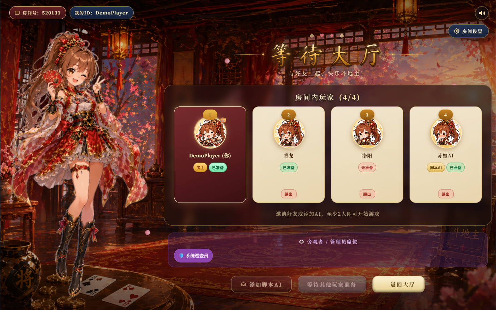
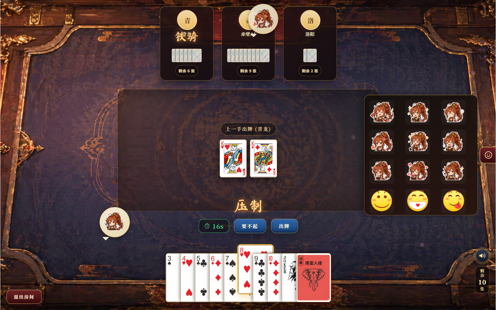
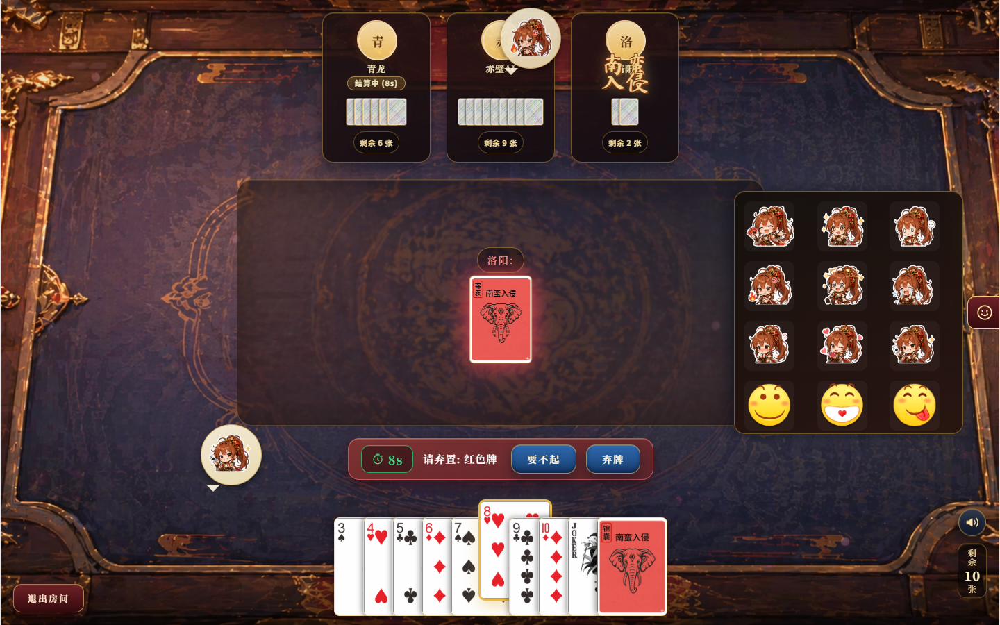
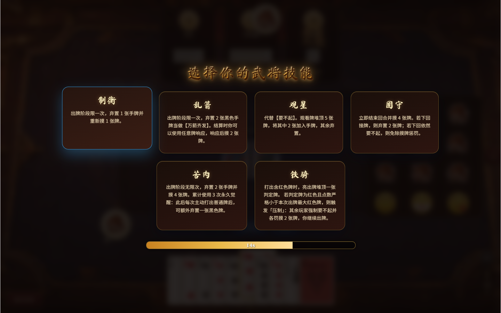
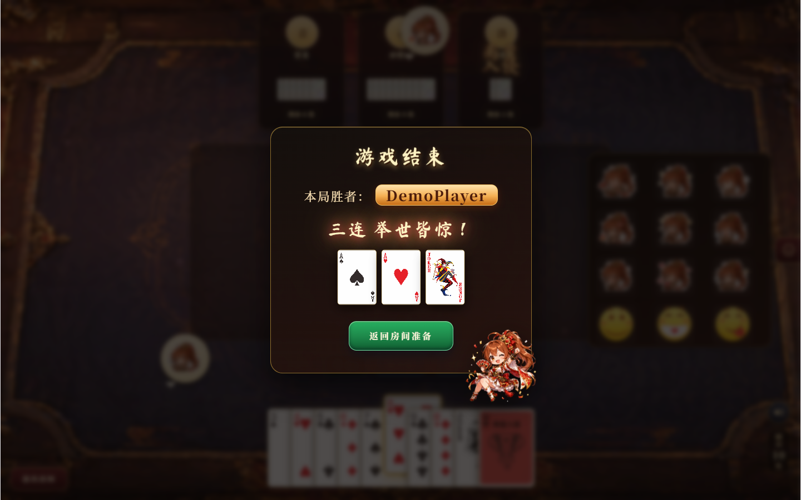
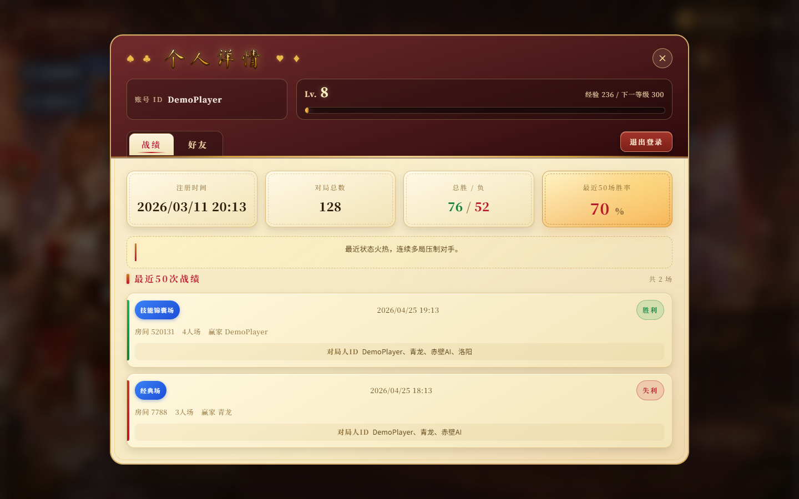

# 🃏 三国斗地主 · Online-Poker — 实时多人策略卡牌游戏

> 在经典斗地主玩法之上，融合《三国杀》式「武将技能」与「群体锦囊」机制的全栈 Web 联机对战平台。

## 🌐 在线体验与源码

  - **在线游玩地址：** [http://39.102.60.181/](http://39.102.60.181/)
  - **GitHub 源码：** [https://github.com/kiri603/online-poker-repo/](https://github.com/kiri603/online-poker-repo/)
  - **测试 / 反馈 QQ 群：** `1082246463`

## 💡 项目简介

本项目是一个支持多人实时联机、复杂技能结算、，并配备完整账号体系的 Web 端卡牌对战游戏。

  - **解决什么问题？** 传统的 Web 棋牌项目往往局限于简单的回合制发牌，缺乏应对高频并发操作和复杂多状态中断（如群体锦囊响应、被动技能插队结算）的工程方案。本项目通过自定义状态机 + 细粒度锁机制 + Redis 会话存储，解决了高并发下的状态同步难题。
  - **有什么特色玩法？** 在 54 张标准扑克的基础上引入：1) 7 个可选**武将技能**（制衡 / 乱箭 / 观星 / 固守 / 苦肉 / 铁骑 / 归心），覆盖主动 / 被动 / 觉醒 / 判定 / 响应保护多种触发模式；2) 4 张无花色**群体锦囊**（万箭齐发 / 南蛮入侵 / 五谷丰登 / 借刀杀人），加入后牌库扩展为 58 张。
  - **适用于什么场景？** 适合好友在线开黑娱乐，同时也是展示 **全栈开发、WebSocket 实时通信、并发编程、状态机设计、账号体系与持久化** 能力的完整工程实践。

## ✨ 核心特性

  - [x] **新手教学**：大厅可选择基础教程或锦囊牌进阶教程；小桃用“元气甜妹”中文配音引导本地模拟对局，基础完成后可继续学习四种锦囊。语音支持全局静音、暂停和退出清理。
  - [x] **⚡ 毫秒级实时同步**：基于 WebSocket 的双向通信，确保多人开局、出牌、技能结算、锦囊响应的极低延迟。
  - [x] **🧠 复杂业务状态机**：完整支持「借刀杀人」「五谷丰登」「万箭齐发 / 南蛮入侵」等 AOE 锦囊的挂起、插队响应、超时判定与状态恢复；以及「铁骑判定 → 压制」「苦肉觉醒 → 弃黑」等触发链。
  - [x] **👤 完整账号体系**：注册 / 登录 / 游客模式 / 验证码防刷 / 设备记住登录；个人中心展示等级、经验、注册时间、对局数、胜负、近 50 场胜率与战绩列表。
  - [x] **账号头像**：登录注册账号后，在右上角个人详情的“账号信息”中选择并保存头像；账号、等待大厅和牌桌同步展示，刷新或重新登录后保留。游客与脚本 AI 沿用默认头像。
  - [x] **🤖 脚本 AI 玩家**：支持房主一键添加 AI，自动进房、自动选技能、自动出牌、自动发表情、自动准备，方便单人测试与凑桌。
  - [x] **🏛️ 三国主题大厅**：联机大厅支持公开房间列表、房间号加入、私密房间、更新公告与游戏规则面板。
  - [x] **🎨 现代化沉浸式 UI**：基于 Vue 3 的响应式布局，桌面 / 平板 / 横屏 / 手机均适配，配合武将立绘、表情贴纸、压制特效等动效，交互自然。

## 🛠️ 技术栈

  - **前端架构：** `Vue 3` + `Vite` + CSS
  - **后端架构：** `Java 25` + `Spring Boot 4` + `Spring WebSocket` + `Spring Security Crypto`
  - **数据层：** `Spring Data JPA` + `MySQL` + `Flyway`（生产）/ `H2`（本地开发）
  - **缓存与会话：** `Redis`（Spring Session + 业务缓存）
  - **部署与运维：** 阿里云 CentOS + `Nginx` + `GitHub Actions` 自动化部署


## 📸 游戏截图

### 登录入口与账号体系

| 首页（快速开始 / 账号登录） | 账号登录 / 注册（含验证码） |
| :---: | :---: |
|  |  |

### 联机大厅与更新公告

| 联机大厅（房间号加入 / 公开房间列表） | 更新公告（武将、AI、账号系统） |
| :---: | :---: |
|  |  |

### 创建房间与等待大厅

| 创建房间（锦囊 / 武将 / 私密 开关） | 等待大厅（4 人位 + 脚本 AI + 旁观席） |
| :---: | :---: |
|  |  |

### 游戏对战桌面

| 出牌阶段（含表情面板与压制提示） | 锦囊响应阶段（南蛮入侵 · 弃红） |
| :---: | :---: |
|  |  |

### 武将技能选择与游戏结算

| 7 武将技能选择（制衡 / 乱箭 / 观星 / 固守 / 苦肉 / 铁骑 / 归心） | 游戏结束（胜者 + 末手亮牌） |
| :---: | :---: |
|  |  |

### 个人中心 · 战绩与等级




## 🚀 本地运行部署

### 前端开发环境

```bash
cd poker-frontend
# 安装依赖
npm install
# 启动本地开发服务器
npm run dev
```

### 后端运行环境

*需确保本地已配置 `JDK 25` 及 `Maven` 环境；如需连接生产数据库请额外准备 `MySQL 8+` 与 `Redis`，否则默认使用内嵌 `H2`。*

```bash
cd poker
# 清理并打包项目（跳过测试）
mvn clean package -DskipTests
# 启动 Spring Boot 服务
java -jar target/poker-0.0.1-SNAPSHOT.jar
```

头像目录统一维护在 `poker-frontend/public/images/avatars/catalog.json`，Maven 打包时将其复制到后端资源中。注册账号通过 `GET /api/avatars` 获取选项，通过 `POST /api/avatars/me` 提交 `{ "avatarId": "general" }`；身份取自当前登录会话，只接受目录中的头像 ID。

头像选择保存在 `user_account.avatar_id`，旧账号为空时使用小桃笑脸。默认 H2 开发配置通过 Hibernate 更新字段；使用 Flyway 的 MySQL 配置通过 `V3__user_avatar.sql` 增加字段，按现有数据库发布流程执行迁移并重启后端。

### 小桃教程配音

教程共 38 段配音，覆盖邀请、基础教程、锦囊教程、完成、退出和异常提示。对白由 `Qwen/Qwen3-TTS-12Hz-1.7B-VoiceDesign` 直接生成，开场邀请已按“呀，主公你来啦！”重新配音，原始试音仍保存在源目录。邀请和锦囊开场沿用最初选中的“元气甜妹”声音描述，其他修正版按试听反馈使用自然语气，基础教程完成对白使用平静、轻柔的鼓励语气。逐句声音描述、语气和随机种子记录在 `voice.json` 的 `delivery_profiles` 和 `line_profiles` 中。游戏从 `poker-frontend/public/audios/xiaotao/` 播放音频，换句会停止上一句，静音和暂停保留进度，退出时清理播放。

字幕使用每段音频与文案对齐得到的字词时间点，跟随实际播放时间显示。加载等待、弹窗和页面隐藏时，声音与字幕一起暂停；关闭声音、减少动态效果或音频失败时显示全文。玩家可以主动显示全文，或点击“跳过讲解”停止当前语音并继续；正常讲解结束后显示下一句或开始操作按钮。

对话框右上角的“小桃语音”仅控制教程讲解和退出提示，不影响背景音乐与游戏音效；右下角仍保留全局声音开关。“自动播放”默认关闭，开启后在当前教程内跨句、跨节继承，等待配音结束后推进讲解；静音或音频不可用时留出阅读时间。自动播放在弹窗和后台暂停，进入操作阶段时等待玩家行动，完成和异常页面仍由玩家手动选择。重新开始或重新进入教程时，自动播放恢复关闭。

音色描述、原始试音、逐句生成记录和 `listen.html` 试听页保存在 `poker-frontend/asset-sources/voices/xiaotao/`。VoiceDesign 用描述控制声音风格，不能保证不同对白拥有完全相同的声线。

修改教程对白后，在已配置 CUDA 版 PyTorch 的独立 Python 环境中，从仓库根目录执行：

```powershell
python -m pip install -r scripts/requirements-xiaotao-tts.txt
python scripts/generate_xiaotao_audios.py
```

可通过 `--model "本地模型目录"` 使用已下载的 VoiceDesign 模型。脚本按文案、逐句语气配置和文件校验值复用现有语音，只重新生成缺失或变化的片段，并更新音频目录和试听页。修正版使用不同文件名，避免浏览器继续播放旧缓存。`--prepare-only` 可更新目录与试听页；只有邀请文案与原始试音一致时才恢复原始邀请音频，它不合成新对白。

生成或更换音频后，在独立的字幕对齐环境中执行以下命令。`qwen-asr` 与 `qwen-tts` 依赖的 Transformers 版本不同，应分别安装。对齐使用本地模型 `Qwen/Qwen3-ForcedAligner-0.6B`，无需外部转写服务；同样支持 `--model "本地模型目录"`。时间点与音频和文案的 SHA256 绑定，修改后需重新对齐。

```powershell
python -m pip install -r scripts/requirements-xiaotao-alignment.txt
python scripts/align_xiaotao_audios.py
```

## 📅 未来规划

  - [ ] **武将池扩展**：在现有 7 名武将基础上，加入更复杂的连锁响应 / 触发链技能。
  - [ ] **锦囊扩充**：新增针对单人的指向性锦囊与连锁响应锦囊（如「无懈可击」式反制）。
  - [ ] **全局聊天频道**：在大厅加入跨房间的全局聊天与好友邀请，增强玩家互动。
  - [ ] **赛季 / 排位机制**：基于现有等级与胜率系统，加入赛季奖励与匹配分。
  - [ ] **观战与录像回放**：基于现有「旁观席」扩展为完整观战 + 局后回放功能。

## 🤝 贡献指南

欢迎提交 Pull Request 优化代码或提出 Issue 讨论新的游戏机制 / 武将技能 / 锦囊设计。如果这个项目对你有启发，欢迎点个 ⭐️ Star！

## 👨‍💻 作者

  - **GitHub:** [@kiri603](https://github.com/kiri603)
  - **邮箱:** 1306842652@qq.com / chenziqian0603@gmail.com
